# windows_vscode_platformio_guide
A workshop assignment to create a guide for installing PlatformIO on our system.

# Introduction

This is a Windows- & VSCode extension based guide for installing PlatformIO IDE and getting started.

# Download Extension

-   Open your VSCode and go to the extension manager/marketplace (CTRL + Shift + X).
-   Search "PlatformIO IDE".

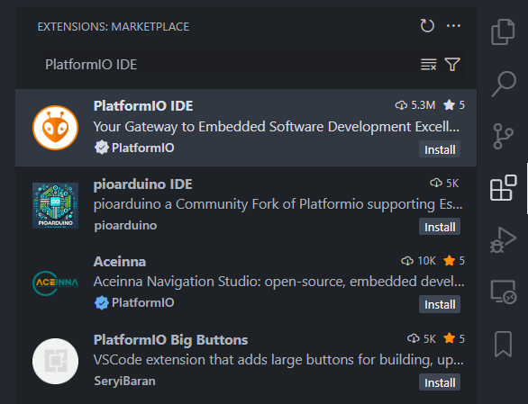

-   Press "Install" for the package, and accept first-time-download warnings.

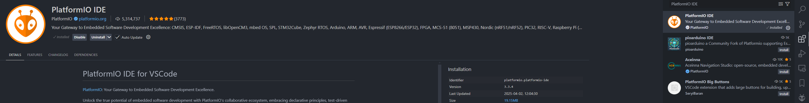

-   Navigate to your sidebar and open the PlatformIO Extension.

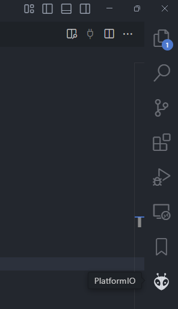

-   If necessary when opening the extension, download the requirements. This may take a while, and will appear in your VSCode terminal. Once this process is done, you should restart your VSCode.

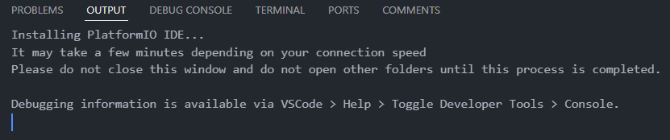

# Your First PlatformIO Project

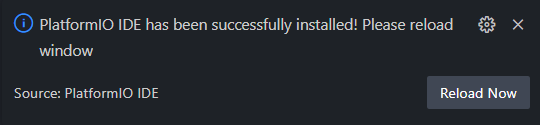

-   Now, open the PlatformIO Extension. Either import a previous project, or create a new one to get started.

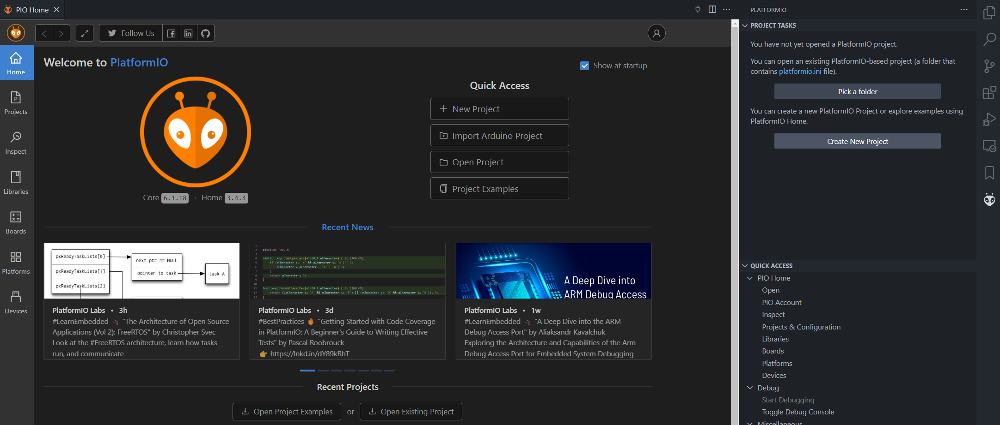

-   If creating a new project, input the board you use along with your framework.

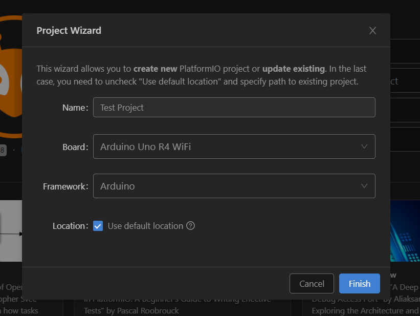

-   Now, wait for it to load.

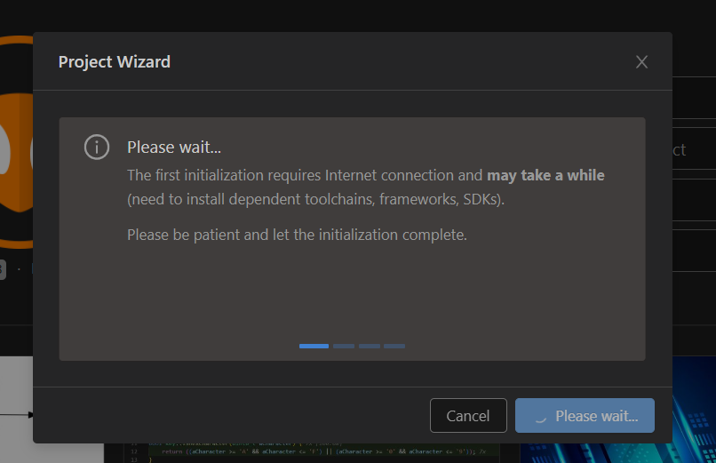

-   Open your main source file found in `src/main.cpp`.
-   Now, paste in your first bit of code.

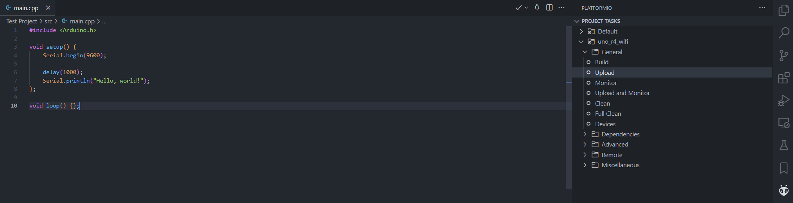

-   Wait for it to upload your source files. This may take some additional time during your first setup.

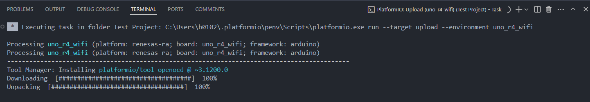

-   Once uploaded, navigate to the sidebar and press "Monitor" to open the serial communication output.

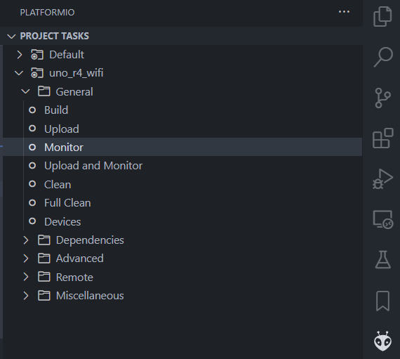

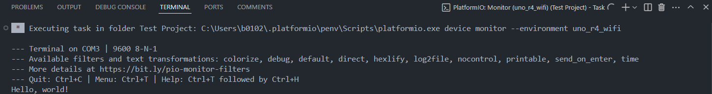

# Useful Links
- [PlatformIO IDE Website](https://docs.platformio.org/en/latest/integration/ide/pioide.html)
- [PlatformIO IDE VSCode Page](https://docs.platformio.org/en/latest/integration/ide/vscode.html#ide-vscode)
